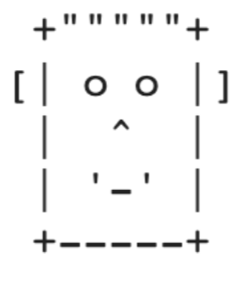

# Exercises

## Essay
* Tulis program Java untuk mencetak `Halo` di layar dan kemudian cetak nama Anda pada baris yang terpisah.
  
  ```java
  public class Main {

      public static void main(String[] args) {

          System.out.println("Halo");
          System.out.println("Teguh");

      }
  }
  ```

* Tulis Java program untuk print wajah seperti dibawah ini
  

  ```java
  public class Main {

      public static void main(String[] args) {

          // Kode lengkap ada di dalam file Main.java :D

      }
  }
  ```